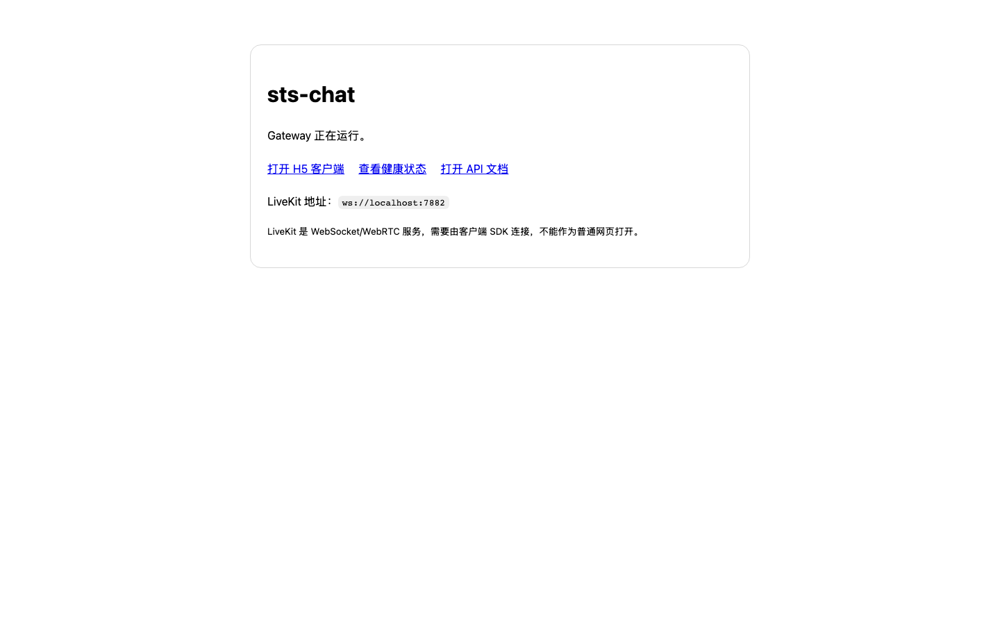
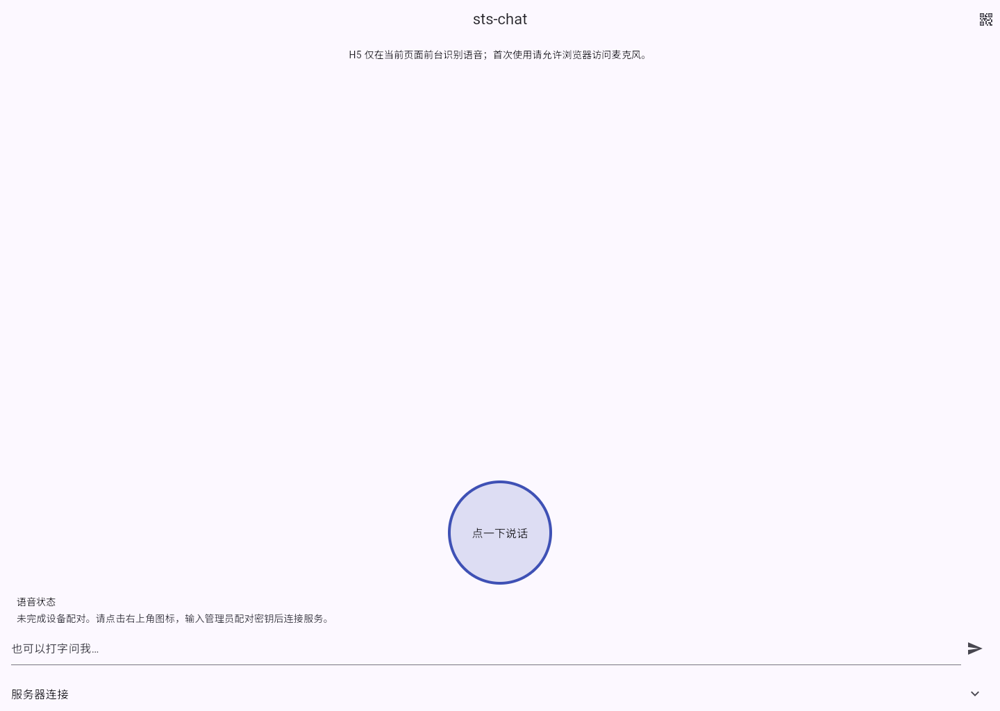
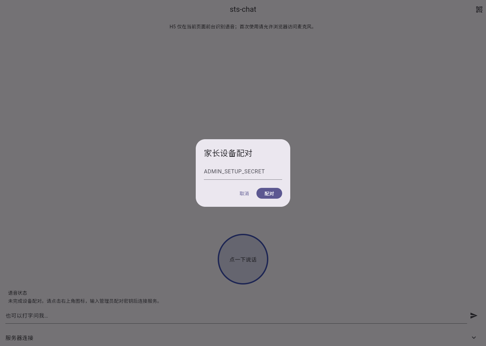
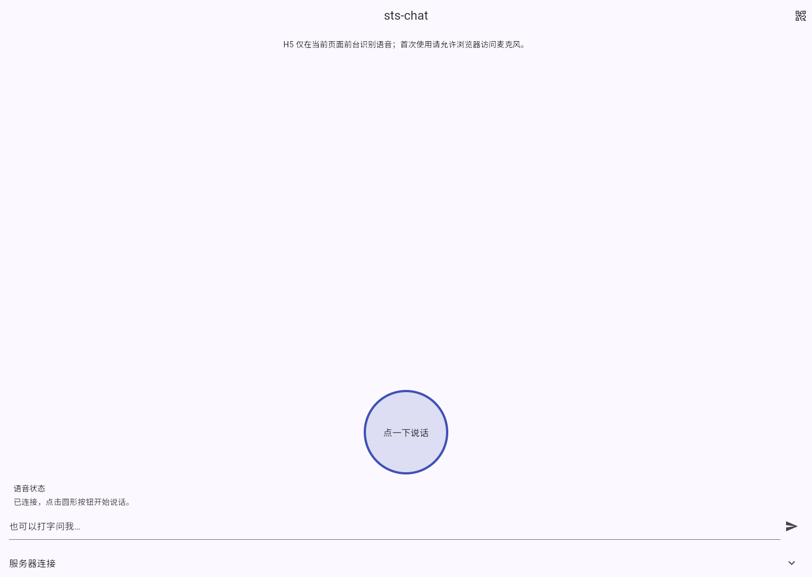

# sts-chat

面向家庭局域网与 Tailscale 私网的跨平台实时语音聊天系统。服务端可托管本地模型；Android、iOS、Windows、macOS 与 H5 使用同一套 LiveKit 实时会话协议。

## 文档

- [部署指南](docs/deployment.md)：环境变量、Docker、Apple Silicon、LaunchAgent、运维与安全边界。
- [使用指南](docs/usage.md)：客户端启动、设备配对、语音聊天、设备撤销与故障排查。

## 当前实现

- ASP.NET Core 8 Gateway：管理员保护的设备配对、设备 JWT、撤销、运行配置、LiveKit token 与聚合健康检查。
- Python voice-agent：本地 llama.cpp 优先、OpenAI 兼容 API 兜底、安全提示词、流式回答事件和打断取消机制；提供内部健康检查端点。
- Docker Compose：Gateway、Voice Agent、LiveKit 以及可选 CUDA llama.cpp 服务。
- Flutter 客户端：Android、iOS、macOS、Windows 和支持 Web Speech API 的 H5 浏览器使用按键式本地短语识别和本地语音播报；识别后的文本通过 LiveKit 实时会话提交，保留文字输入作为回退。

本版本传输的是 LiveKit data-channel 文本事件，而不是原始音频轨道：设备本地完成 ASR/TTS，服务端只处理文本问题和流式回答。模型权重不提交到仓库。

## 本机快速运行

以下流程用于同一台 macOS/Windows 开发机上的 H5 体验，已验证设备配对、Gateway、LiveKit 与 Voice Agent 的端到端连接。`docker-compose.local.yml` 会让 LiveKit 仅通告 `127.0.0.1` 的 WebRTC 候选地址，因此不能用于局域网、Tailscale 或公网部署。

```bash
# 启动 Gateway、LiveKit 与 Voice Agent。
docker compose \
	-f docker-compose.yml \
	-f docker-compose.macos.yml \
	-f docker-compose.local.yml \
	up -d --build gateway livekit voice-agent

# 构建并提供 H5 客户端。
cd src/client
flutter pub get
flutter build web --release --dart-define=GATEWAY_URL=http://localhost:8084
python3 -m http.server 3002 --bind 127.0.0.1 --directory build/web
```

打开 `http://localhost:3002`，Gateway 健康检查位于 `http://localhost:8084/health`，本机 LiveKit 信令地址为 `ws://localhost:7882`。首次打开客户端后，通过右上角图标输入 `ADMIN_SETUP_SECRET` 完成设备配对。

本机未放置 GGUF 模型时，上述服务仍可验证配对与实时会话连接；`/health` 会将 LLM 标记为不可用。将模型放入 `models/` 后，以同一组 Compose 文件加上 `--profile cpu-model` 启动即可验证问答链路。

## 运行截图

**Gateway 服务入口**



**H5 客户端首页**



**管理员设备配对**



**设备配对完成并连接 Agent**



## 自动构建与发布

`.github/workflows/build-release.yml` 会在 Pull Request、手动触发或推送 `v*` 版本标签时构建六份客户端发布产物：

| 平台 | 工作流产物 | GitHub Release 文件 |
| --- | --- | --- |
| Android | 通用 Debug APK（armv7、arm64、x64） | `sts-chat-android-debug.apk` |
| iOS arm64 | 未签名 IPA | `sts-chat-ios-arm64-unsigned.ipa` |
| Windows x64 | Release 文件夹 ZIP | `sts-chat-windows-x64.zip` |
| Windows ARM64 | Release 文件夹 ZIP | `sts-chat-windows-arm64.zip` |
| macOS x64 | Intel App ZIP | `sts-chat-macos-x64.zip` |
| macOS ARM64 | Apple Silicon App ZIP | `sts-chat-macos-arm64.zip` |

推送符合 `v*` 的标签会在六项构建全部成功后自动创建或更新 GitHub Release，并上传上述文件和 `SHA256SUMS.txt`。Android 初始产物使用调试签名；iOS IPA 未签名；Windows 和 macOS 初始产物未进行代码签名或公证，只适合测试与内部验证。正式分发前应配置各平台的签名证书与发布流程。

## Windows 部署

1. 安装 Docker Desktop（开启 WSL2 与 NVIDIA GPU 支持）和 Tailscale；让服务器和客户端加入同一 Tailnet。
2. 复制 `.env.example` 为 `.env`，填入强随机 `ADMIN_SETUP_SECRET`、`JWT_SECRET`、LiveKit 密钥和可选 API 配置。不要提交 `.env`。
3. 下载 GGUF 模型到 `models/Qwen2.5-3B-Instruct-Q4_K_M.gguf`，或改写 `LLM_LOCAL_BASE_URL` 指向自己的 llama.cpp 服务。
4. `docker compose --profile models up -d --build`，然后打开 `https://<tailnet-host>/health` 或本机 `http://localhost:8080/health`。
5. Windows 电源策略设为“接通电源时从不睡眠”，并保持 BitLocker、Windows 防火墙和 Tailscale 登录开启。

## Flutter 客户端

安装 Flutter stable SDK 后，在 `src/client` 执行：

```bash
flutter pub get
flutter run -d chrome --dart-define=GATEWAY_URL=http://localhost:8080
```

iOS/macOS 打包需在 macOS 上使用完整 Xcode；Android/Windows 可在 Windows 上构建。更多运行方式见[使用指南](docs/usage.md)。

网络受限时，可在安装 Flutter 依赖或构建 Docker 镜像前按自己的网络环境设置可选代理：

```bash
export HTTP_PROXY=http://proxy.example.com:8080
export HTTPS_PROXY=http://proxy.example.com:8080
```

未设置代理时，Docker 与 Flutter 会直接使用默认公共依赖源。`docker-compose.yml` 仅在显式设置后才会将代理变量传给 Gateway 的 NuGet 恢复步骤；Flutter 包安装也会读取同一组变量。

原生客户端首次点击语音按钮时会请求麦克风权限；iOS 和 macOS 还会请求系统语音识别权限。语音交互为短句按键式识别，不支持后台持续监听或自定义唤醒词。

完成设备配对后，客户端在前台提供持续对话：每轮语音转写、Agent 推理和本地播报完成后会自动重新开启短句监听。圆形按钮在监听时显示“点一下暂停”，可显式结束持续对话。H5 需要浏览器支持 Web Speech API，并且只能在当前前台页面持续运行。

## macOS 开发部署

Apple Silicon 可以运行 Gateway、LiveKit、Voice Agent 与 CPU 版 llama.cpp，但速度不等同于 RTX 4060。Docker 部署会在内部网络启动 `llama-cpu`，首次启动完整服务：

```bash
docker compose --profile cpu-model -f docker-compose.yml -f docker-compose.macos.yml up -d --build
```

`llama-cpu` 使用 `models/Qwen2.5-3B-Instruct-Q4_K_M.gguf`，Gateway 与 Voice Agent 均通过 Docker 私有地址 `llama-cpu:8080` 调用它。Homebrew `llama-server` 和 `deploy/com.stschat.llm.plist` 可继续用于独立的本机 Metal 实验，但不是该 Docker Compose 栈的依赖。

H5 Release 构建产物安装到 `~/Library/Application Support/StsChat/web`，由 `deploy/com.stschat.web.plist` 在 `http://localhost:3000` 提供本地服务。localhost 属于浏览器安全上下文，可申请麦克风权限。

原生 macOS App 还要求从 App Store 安装完整 Xcode 并执行 `sudo xcode-select -s /Applications/Xcode.app/Contents/Developer`；仅有 Command Line Tools 无法运行 `flutter build macos`。

macOS 部署冒烟测试：

```bash
./scripts/smoke-macos.sh
```

该脚本验证设备配对、JWT、LiveKit 房间创建和 Agent Dispatch，并自动撤销测试设备。

macOS 默认仅使用 `ws://localhost:7880`，不应作为远程家庭服务器。安装并登录 Tailscale 后，设置 `.env` 的 `LIVEKIT_URL` 为相应的私网 WSS 地址，并为 Gateway 配置 HTTPS 反向代理。

在 macOS 使用本机 Python 运行 Voice Agent 时，可加载仓库提供的 LaunchAgent：

```bash
launchctl bootstrap gui/$(id -u) deploy/com.stschat.agent.plist
launchctl print gui/$(id -u)/com.stschat.agent
```

由于 macOS 后台进程不能可靠读取外接卷，部署时需把 `.venv`、`.env` 和 `src/voice_agent` 同步到 `~/Library/Application Support/StsChat`，LaunchAgent 使用该运行时副本；修改源码后重新同步并重载服务。

## 远程访问边界

首版要求远程设备安装并连接 Tailscale；模型、SQLite 与管理接口绝不直接向公网暴露。H5 需要前台运行并完成麦克风授权，iOS 只支持前台连续对话或 Siri Shortcut 唤起，不能承诺后台自定义唤醒词。

## 验证

```bash
dotnet test tests/Gateway.Tests/Gateway.Tests.csproj
docker compose --profile cpu-model -f docker-compose.yml -f docker-compose.macos.yml config
```

模型服务启动后，`GET /health` 会检查 Gateway、LiveKit、LLM 与 voice-agent 的可达性；ASR/TTS 会明确显示为 `client-owned`，因为它们由原生客户端的系统服务提供。
